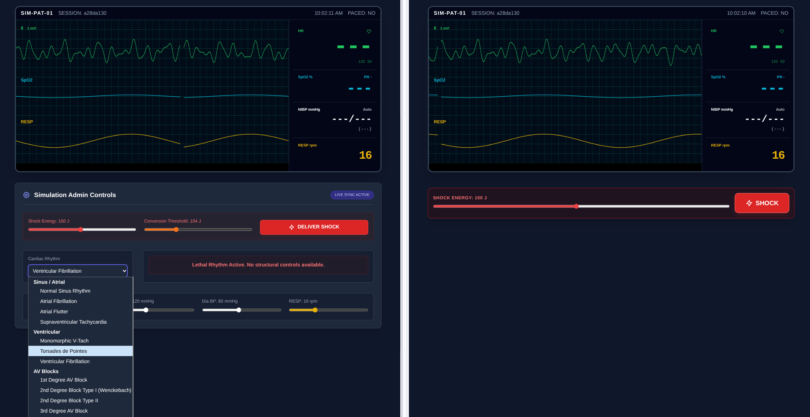

<!-- feature: ekg-demo.png -->
<!-- version: 1.0.0 -->

# Telemetry Monitor Simulator

A browser-based cardiac telemetry simulator built for clinical education and simulation lab use. An instructor controls a simulated patient's cardiac state in real time, while learners observe a realistic monitor display — all synchronized over the network with no special software required.

---

## What It Does

The app generates two independent, shareable URLs from a single session:

| URL | Who uses it | What they see |
|-----|-------------|---------------|
| **Simulation Viewer** (`?view=sim&id=...`) | Learners / patient display screen | Live EKG monitor |
| **Instructor Controller** (`?view=ctrl&id=...`) | Instructor / facilitator | Same monitor + full admin controls |

The instructor changes a rhythm or vital sign; the viewer updates within ~150 ms. No page refresh needed on either end.

---

## Interface Mockup



---

## Three Waveform Traces

All three traces scroll continuously at 180 px/second on an HTML5 canvas with a green-grid background that mimics real telemetry paper.

| Trace | Color | What it shows |
|-------|-------|---------------|
| **Lead II EKG** | Green | P waves, QRS complexes, T waves — morphology varies by rhythm |
| **SpO₂ / Pleth** | Cyan | Pulse oximetry plethysmography waveform |
| **RESP** | Yellow | Respiratory effort waveform; modulated by RESP rate setting |

---

## Supported Cardiac Rhythms

### Sinus / Atrial
| Rhythm | Admin Controls |
|--------|---------------|
| Normal Sinus Rhythm | SA Node Rate (20–220 bpm) |
| Atrial Fibrillation | Ventricular Response Rate; irregular RR intervals; fibrillatory baseline noise |
| Atrial Flutter | Flutter Ratio (1:1 / 1:2 / 1:3 / 1:4); continuous sawtooth flutter waves at 300/min |
| Supraventricular Tachycardia (SVT) | SVT Rate (150–250 bpm) |

### Ventricular
| Rhythm | Admin Controls |
|--------|---------------|
| Monomorphic V-Tach | V-Tach Rate (100–250 bpm); wide, inverted-T QRS morphology |
| Torsades de Pointes | Torsades Rate (150–300 bpm); amplitude modulated by a slow sine envelope |
| Ventricular Fibrillation | No controls; chaotic multi-frequency baseline; vitals display goes to `---` |

### AV Blocks
| Rhythm | Admin Controls |
|--------|---------------|
| 1st Degree AV Block | SA Node Rate + PR Prolongation (0.20–0.40 s) |
| 2nd Degree Type I (Wenckebach) | SA Node Rate; PR progressively lengthens until a beat is dropped (3:1 cycle) |
| 2nd Degree Type II (Mobitz) | SA Node Rate + Block Ratio (2:1, 3:1, or 4:1) |
| 3rd Degree (Complete) | SA Node Rate (P waves) + Ventricular Escape Rate (20–60 bpm); wide QRS, inverted T |

### Lethal
| Rhythm | Notes |
|--------|-------|
| Asystole | Near-flat line with trace noise; vitals display goes to `---` |

---

## Vitals Panel

Instructor-adjustable vitals appear in the sidebar in real time:

| Vital | Range | Display |
|-------|-------|---------|
| SpO₂ | 50–100% | Numeric + pleth waveform |
| Systolic BP | 40–250 mmHg | Numeric |
| Diastolic BP | 20–150 mmHg | Numeric + calculated MAP |
| Respiratory Rate | 0–50 rpm | Numeric + RESP waveform speed |
| Heart Rate | Derived from rhythm | Large numeric display; updates every 2 s with ±1 bpm jitter for realism |

> Vitals display as `---` when the rhythm is VFib or Asystole.

---

## Defibrillation / Cardioversion

Both the **instructor** and the **learner** (via the sim URL) can attempt a shock.

**Instructor panel:**
- Set **Shock Energy** (10–300 J)
- Set **Conversion Threshold** (25–300 J) — controls how much energy is required for a successful conversion
- Click **DELIVER SHOCK**

**Learner panel** (sim URL only):
- Set their own joule selection (10–300 J)
- Click **SHOCK**

**Outcome logic:**
- If selected joules ≥ threshold **and** the rhythm is shockable (SVT, VFib, VTach, AFib, AFlutter) → rhythm converts to Normal Sinus at 80 bpm with normalized vitals
- Otherwise, the shock artifact appears on all three traces but the rhythm is unchanged
- Shock artifact: large deflection spike followed by a damped oscillation on the EKG, a brief disturbance on the pleth, and a transient on the RESP trace

---

## How a Session Works

```
1. Instructor visits the app root → clicks "Start New Session"
2. Server generates an 8-character session ID and temp JSON state file
3. Two URLs are displayed + a QR code for the controller URL:
      Viewer  →  ?view=sim&id=a3f8c1d2
      Control →  ?view=ctrl&id=a3f8c1d2
4. Instructor opens the controller URL (or scans QR)
5. Learners open the viewer URL on another screen / device
6. Instructor changes rhythm or vitals → POSTed to server → viewer polls at 150 ms
7. Session state persists as long as the temp file exists on the server
```

---

## Technical Notes

- **Backend:** Single PHP file. State stored as JSON in the system temp directory (`/tmp/telemetry_sim_{id}.json`). No database required.
- **Frontend:** Vanilla JS + Tailwind CSS (CDN). No build step.
- **Waveform rendering:** HTML5 Canvas using Gaussian function superposition for realistic P/QRS/T morphology. Baseline noise, respiratory modulation, and rhythm-specific artifacts are computed per-pixel.
- **Sync:** Viewer polls `?action=poll&id=...` every 150 ms. Controller pushes via `?action=update&id=...` on every input change.
- **Responsive:** Sim view fills landscape mobile screens. Controller view stacks the monitor as a sticky header with controls scrolling below on small screens.
